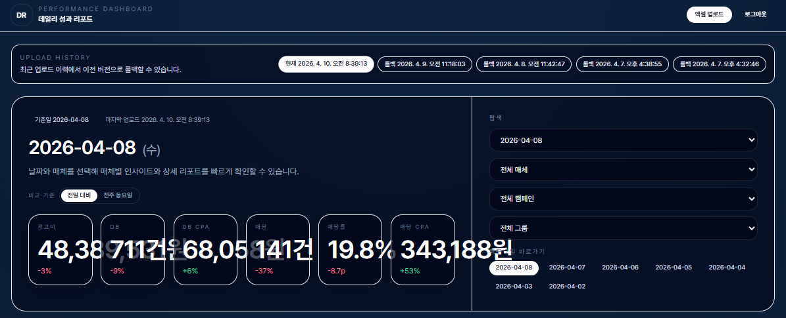
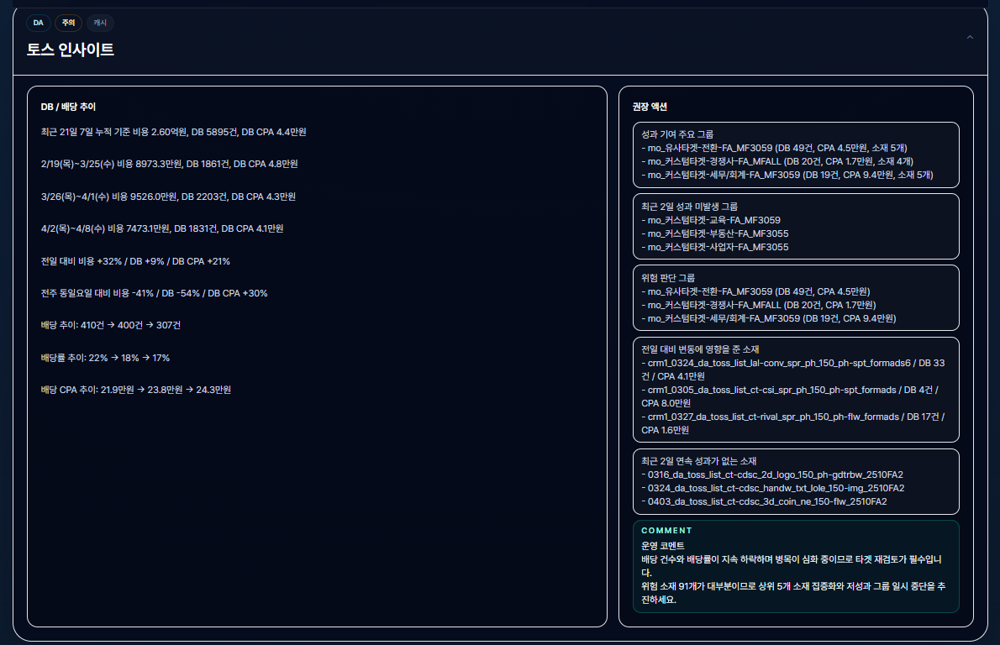

# 메리츠 데일리 성과 대시보드

매체별 광고 성과를 실시간으로 분석하고, AI 인사이트를 제공하는 내부 리포트 대시보드입니다.




## 주요 기능

- **엑셀 업로드 및 파싱** - `MASTER_RAW` 시트 기반 데일리 리포트 자동 분석
- **매체별 KPI 대시보드** - DB, CPA, 배당률, 비용 등 핵심 지표 전일/전주 비교
- **AI 인사이트** - Anthropic Claude API를 활용한 매체별 자동 분석 코멘트
- **다차원 필터링** - 날짜 / 매체 / 캠페인 / 광고그룹 단위 탐색
- **요약 / 상세 / 텍스트 탭** - 용도에 맞는 리포트 형식 제공
- **그룹 인사이트** - 광고그룹 기반 성과/위험 그룹 자동 분류
- **업로드 히스토리 및 롤백** - 이전 업로드 버전으로 복원 가능
- **인사이트 캐시** - 날짜 + 매체 + 리포트 버전 기반 캐싱으로 중복 API 호출 방지

## 기술 스택

| 영역 | 기술 |
|------|------|
| 프레임워크 | Next.js 16 (App Router) |
| 스타일 | Tailwind CSS v4 |
| 스토리지 | Vercel Blob (Private) |
| AI | Anthropic Messages API (Claude Haiku) |
| 엑셀 파싱 | SheetJS (xlsx) |
| 배포 | Vercel |
| 인증 | Cookie 기반 비밀번호 인증 (HMAC-SHA256) |

## 프로젝트 구조

```
app/
  api/
    report/       # 리포트 CRUD (GET/POST/PATCH)
    insight/      # AI 인사이트 생성
    analyze/      # 분석 API
    blob-upload/  # Vercel Blob 업로드
    login/        # 로그인
    logout/       # 로그아웃
  login/          # 로그인 페이지
  page.tsx        # 메인 대시보드 페이지

components/
  dashboard/
    Dashboard.tsx           # 메인 대시보드 컴포넌트
    MetricCard.tsx          # KPI 카드
    useMediaInsights.ts     # AI 인사이트 fetch 훅
    UploadHistory.tsx       # 업로드 히스토리
    CostFilter.tsx          # 비용 필터 (토스)
  MediaInsightCard.tsx      # 매체 인사이트 카드
  SummaryCard.tsx           # 매체 요약 카드
  DetailPanel.tsx           # 상세 리포트 패널
  GroupInsightSection.tsx   # 그룹 인사이트

lib/
  analyzer.ts       # 분석 로직 (KPI 계산, 전일/전주/월평균 비교)
  media-catalog.ts  # 매체 카탈로그 (DA/SA/OTHER 분류)
  excel.ts          # 엑셀 파싱 (MASTER_RAW 시트)
  storage.ts        # Vercel Blob 스토리지 래퍼
  auth.ts           # 인증 유틸리티
  types.ts          # TypeScript 타입 정의
  config.ts         # KPI 기준값 설정

tests/
  run.ts            # 테스트 스위트
```

## 시작하기

### 환경 변수 설정

`.env.local.example`을 복사하여 `.env.local`을 생성합니다.

```bash
cp .env.local.example .env.local
```

| 변수 | 설명 | 필수 |
|------|------|------|
| `BLOB_READ_WRITE_TOKEN` | Vercel Blob 읽기/쓰기 토큰 | O |
| `ANTHROPIC_API_KEY` | Anthropic API 키 (AI 인사이트용) | O |
| `DASHBOARD_PASSWORD` | 대시보드 로그인 비밀번호 | O |
| `ANTHROPIC_MODEL` | 사용할 Claude 모델 | X |

### 설치 및 실행

```bash
npm install
npm run dev
```

### 빌드 및 테스트

```bash
npm run build
npm test
```

## 사용 방법

1. 대시보드 접속 후 비밀번호로 로그인
2. **엑셀 업로드** 버튼으로 데일리 리포트 파일(`.xlsx`) 업로드
3. 날짜/매체/캠페인/그룹 필터로 원하는 범위 탐색
4. **요약** 탭에서 매체별 AI 인사이트 확인
5. **상세 리포트** 탭에서 소재 단위 성과 확인
6. **텍스트** 탭에서 리포트 복사 또는 다운로드

## 매체 분류

| 섹션 | 매체 |
|------|------|
| DA | 메타 (DA), 메타 (VA), 메타 (TOTAL), 구글 (DA), 토스 |
| SA | 네이버 SA, 구글 SA, 카카오 SA |
| 기타 | 카카오뱅크, 삼쩜삼, 기타항목 |

## 배포

Vercel에 연결되어 있으며, `main` 브랜치 push 시 자동 배포됩니다.

```bash
# 수동 프로덕션 배포
vercel deploy --prod
```

**Production URL:** https://daily-report-dashboardnre.vercel.app
